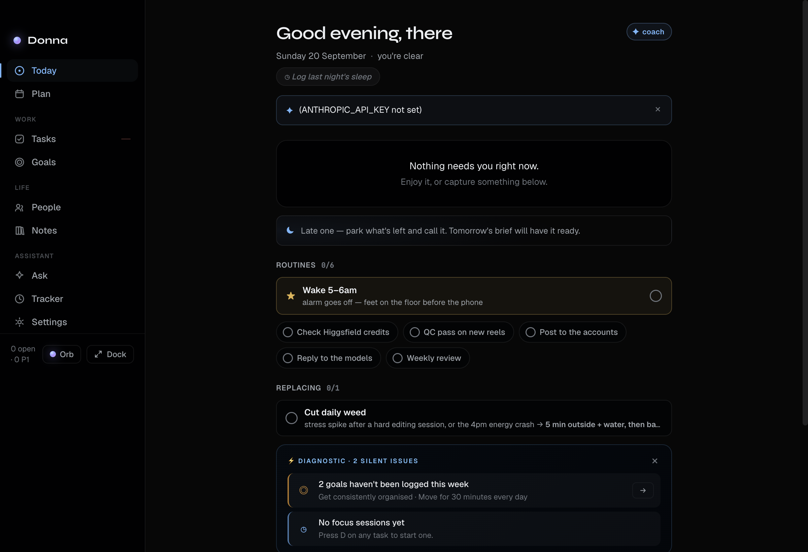
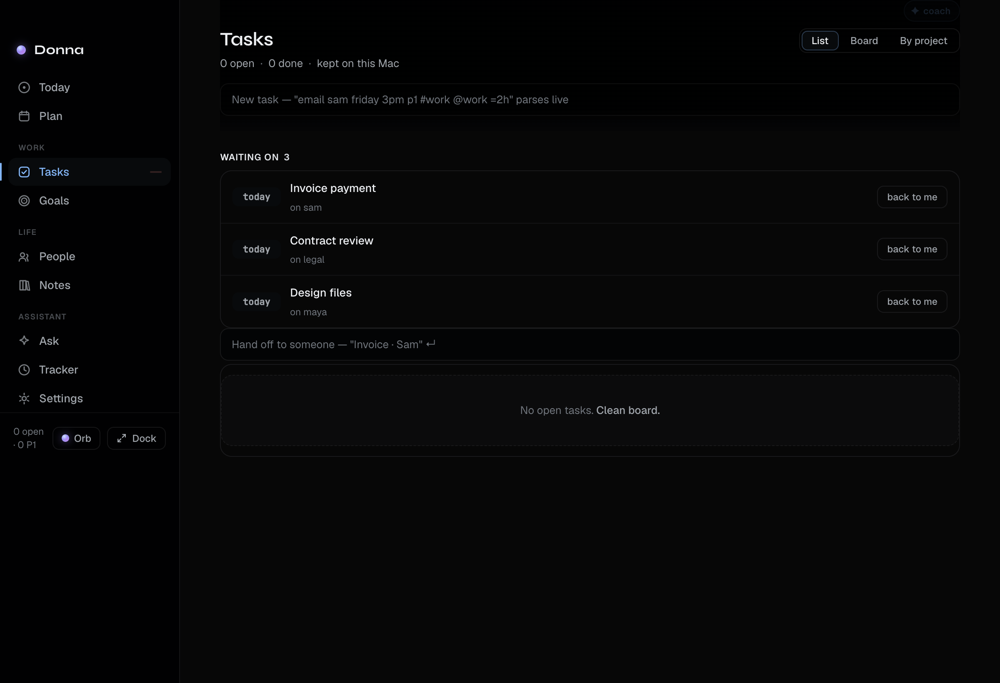

# Donna

**Donna is a local-first personal assistant for macOS.** She lives in your menu
bar and (optionally) as a little orb on your desktop, keeps your tasks, goals,
habits, notes and focus sessions in one place, and answers questions using
**your own** AI key.

No account. No cloud sync. No telemetry. Everything stays on your Mac.

---

## Install

### One-line install (recommended — no Gatekeeper warning)

```sh
curl -fsSL https://raw.githubusercontent.com/alj04ofm-svg/donna/main/install.sh | bash
```

Downloads the latest release with `curl` (so macOS never sets the quarantine
flag), installs to `/Applications`, clears quarantine, and ad-hoc signs the app
so it runs on Apple Silicon.

### Manual (DMG)

1. Download `Donna-<version>-universal.dmg` from
   [Releases](https://github.com/alj04ofm-svg/donna/releases).
2. Open it and drag **Donna** to **Applications**.
3. First launch: **right-click → Open** (not notarized yet), or:

   ```sh
   xattr -dr com.apple.quarantine /Applications/Donna.app
   ```

4. Walk through the setup wizard: your name → AI provider + key → what Donna may read.
5. Press `⌘⇧Space` anywhere to summon her.

**Requirements:** macOS 13+ (Ventura or later). Universal (Apple Silicon + Intel).

---

## Screenshots




## Features

| | |
|---|---|
| **Today** | A calm start: your focus task, today's list, habits, and a short brief. |
| **Plan** | Time-block your day around your calendar. |
| **Tasks** | Horizons + a 3-column board, priorities, due dates, estimates, focus timers. |
| **Goals** | Objectives, key results, milestones, weekly commitment. |
| **Habits** | Flexible daily/weekly habits with streaks. |
| **Notes / Library** | Durable notes, highlights and captures. |
| **Ask Donna** | Chat grounded in the files/folders you point her at. |
| **Tracker** | Optional, fully local time tracking and focus sessions. |
| **Capture** | A global quick-capture bar (`⌥Space`). |
| **Settings** | Name, AI provider + key, notifications, permissions, data export, updates. |

Summon with `⌘⇧Space`; quick-capture with `⌥Space`; everything also lives in the
Dock and menu bar.

---

## AI providers (bring your own key)

Set your key in the setup wizard or **Settings → General**. Environment variables
take precedence:

| Provider  | Env var              |
|-----------|----------------------|
| Anthropic | `ANTHROPIC_API_KEY`  |
| OpenAI    | `OPENAI_API_KEY`     |
| MiniMax   | `MINIMAX_API_KEY`    |

You can also choose **Claude CLI (local, no key)** if you have the `claude`
command installed.

---

## Your data & privacy

Everything lives locally at `~/Library/Application Support/Donna/` — tasks,
notes, goals, habits, tracker events and your config (mode `0600`). Donna never
uploads your data anywhere; AI requests go directly from your Mac to the
provider you chose, with your key.

Export a backup any time from **Settings → Data**.

---

## Updates

- **Settings → Data → Check for updates** finds the latest release and updates
  Donna in place (downloads the new build, swaps it in, relaunches). This works
  without an Apple Developer account.
- You can also re-run the one-line installer.

---

## Troubleshooting

**"Donna is damaged" / won't open** — she isn't notarized (that needs a paid
Apple Developer account). Run:

```sh
xattr -dr com.apple.quarantine /Applications/Donna.app
codesign --force --deep --sign - /Applications/Donna.app
```

**Screen-recording / calendar prompts** — grant them in **System Settings →
Privacy & Security**; Donna's Tracker and Plan use them, purely locally.

**Port / single-instance** — Donna runs a single instance. If a second copy
won't open, quit the first (menu-bar → Quit Donna).

---

## Build from source

```sh
git clone https://github.com/alj04ofm-svg/donna.git
cd donna
npm install
npm start        # run in development
npm run dist     # build .app + .dmg into dist/
```

---

## License

MIT — see [LICENSE](./LICENSE).
